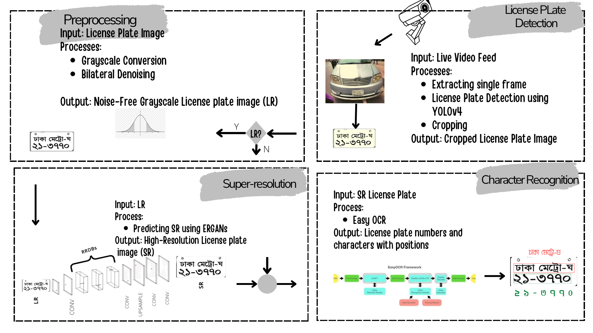
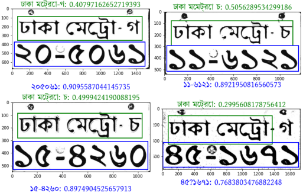

# Four-Stage-Automatic-License-Plate-Recognition-System-for-Bangla-Low-Resolution-License-Plate-images

### Abstract
Automatic License Plate Recognition (ALPR) Sys- tem is a crucial task that is used in numerous
critical situations. Although there are several ways to accomplish license plate recognition,
our method is intended to be effective not just on license plates with high resolution, but even
when the license plate (LP) is of very low resolution (LR). Previous works on ALPR systems
emphasized achieving recognition benchmarks on LP images that are close to the sensor. How-
ever, if the camera is far from the vehicle, the generated detected frame yields an LP image of
LR, which is hard for the recognition model to classify. Our method employed Enhanced Super
Resolution Generative Adversarial Networks (ESRGANs) to upscale the [32 × 24] LR image to
high resolution of dimension [256 × 192] with a scale factor ratio of 8. For training purposes,
we also collected and trained the models on a dataset of 2211 images. The Peak signal-to-noise
ratio (PSNR) for the reconstruction on 200 testing samples is 12.587.The optical character re-
cognition accuracy for the reconstructed and ground truth images are 78 respectively.

### Methodology

### Result

